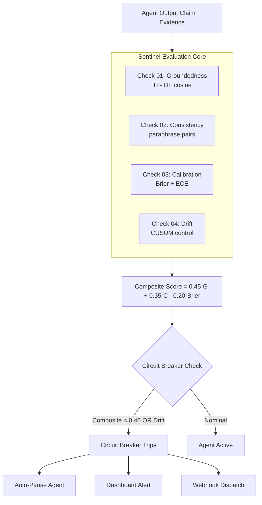
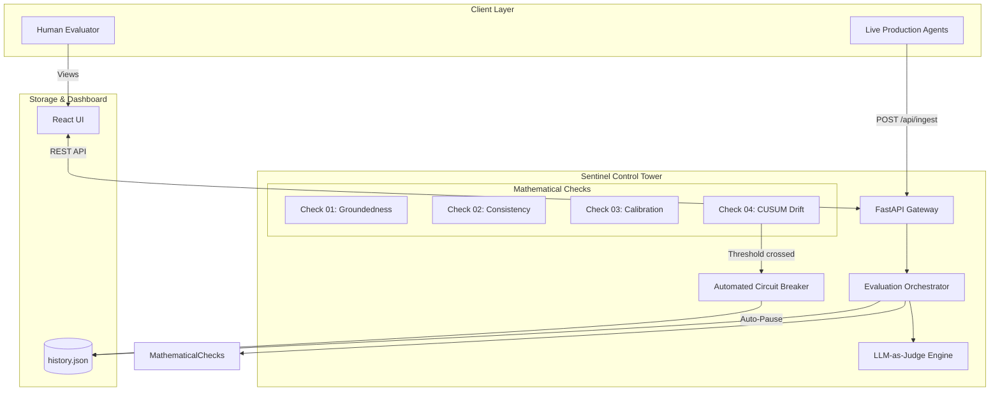

<p align="center">
  
</p>

<h1 align="center">SENTINEL AI</h1>
<p align="center">
  <strong>Model-Agnostic AI Agent Reliability Control Tower & Governance Engine</strong><br/>
  <em>Groundedness · Consistency · Calibration · CUSUM Drift Detection · Automated Circuit Breaker</em>
</p>

<p align="center">
  
  
  
  
  
  
</p>

---

## 📋 Table of Contents
1. [Problem Statement](#-problem-statement)
2. [What Sentinel Does](#-what-sentinel-does)
3. [Architecture Overview](#-architecture-overview)
4. [The 4 Mathematical Reliability Checks](#-the-4-mathematical-reliability-checks)
5. [Composite Health Score & Circuit Breaker](#-composite-health-score--circuit-breaker)
6. [8-Agent Mock Fleet](#-8-agent-mock-fleet)
7. [Demo Data & Evaluation Sets](#-demo-data--evaluation-sets)
8. [Backend Module Reference](#-backend-module-reference)
9. [REST API Reference](#-rest-api-reference)
10. [Sentinel SDK — Live Production Integration](#-sentinel-sdk--live-production-integration)
11. [LLM-as-Judge Engine](#-llm-as-judge-engine)
12. [Alert & Webhook System](#-alert--webhook-system)
13. [Multi-Day Drift Simulation](#-multi-day-drift-simulation)
14. [Frontend Dashboard](#-frontend-dashboard)
15. [Quick Start & Local Setup](#-quick-start--local-setup)
16. [Environment Variables](#-environment-variables)
17. [Running Tests](#-running-tests)
18. [Technology Stack](#-technology-stack)
19. [Roadmap & Honest Limitations](#-roadmap--honest-limitations)

---

## 🚨 Problem Statement

Razorpay currently operates **15+ independent production AI agents** — Bumblebee (merchant risk review), Project Viveka (incident RCA), RCA-GPT (postmortem generation), Cosmos/Prism (model routing), Ray (customer support handling ~70% of queries), Agent Studio (the B2B agent marketplace built on Anthropic's Claude Agent SDK), and the full Sprint 26 suite of 17 specialized agents.

These systems were built by **different teams, on different timelines, using different LLM providers** (Claude, GPT-4, Gemini, Llama). Razorpay's own engineering blog documents three distinct failure modes:

| Failure Mode | Documented Source | Real Impact |
|---|---|---|
| **Inconsistent verdicts** | Bumblebee's pre-fix architecture: two passes on the same merchant reached opposite conclusions | Merchants onboarded or rejected incorrectly |
| **Ungrounded assertions** | Project Viveka was built because letting agents state conclusions without citing evidence is the *default* failure mode | Wrong incident root causes shipped to engineers |
| **Hallucination-driven routing** | Cosmos/Prism exists specifically to cut single-vendor hallucination rates by routing across 4 model providers | Incorrect diagnostic chains; trust erosion |

**The gap**: Agent Studio governs *permissions*. Cosmos/Prism governs *which model answers*. Nobody governs whether the output that came back is **actually grounded, consistent, honestly calibrated, and stable over time** — the same way, across every agent, regardless of which team built it.

That gap is Sentinel.

---

## 🛡 What Sentinel Does

Every AI agent in the fleet — regardless of LLM vendor or framework — submits output through one shared contract (`AgentOutput`). Sentinel then runs **four independent mathematical checks** on that output:



In addition to the automated checks, any flagged case can be escalated to the **LLM-as-Judge** engine (`POST /api/agents/{id}/judge`), which calls a real Claude or Gemini API — or falls back to the TF-IDF heuristic — to produce a human-readable YES/NO verdict with a one-sentence rationale.

---

## 🏛 Architecture Overview



### Directory Structure

```
sentinel/
├── backend/                        Python 3.12 + FastAPI
│   ├── app/
│   │   ├── main.py                 FastAPI app + all REST routes (609 lines)
│   │   ├── schema.py               AgentOutput + EvalCase Pydantic models
│   │   ├── backends.py             SimulatedBackend / AnthropicBackend / GeminiBackend
│   │   ├── checks.py               4 mathematical checks (TF-IDF, CUSUM, Brier, ECE)
│   │   ├── tower.py                Orchestrator: runs every agent through all checks
│   │   ├── simulate.py             Multi-day drift simulation engine
│   │   ├── circuit_breaker.py      Auto-pause state machine (persisted to history.json)
│   │   └── alerts.py               Webhook dispatcher / console logger
│   ├── agents/
│   │   ├── base.py                 Agent wrapper (persona + backend)
│   │   └── mock_fleet.py           8 mock agents with distinct failure modes
│   ├── eval_sets/                  8 JSON evaluation datasets (one per agent)
│   ├── data/
│   │   └── history.json            Persisted evaluation history, incidents, CB state
│   ├── tests/
│   │   └── test_checks.py          pytest suite for all 4 check implementations
│   ├── sentinel_sdk.py             1-file Python client for live production integration
│   └── requirements.txt
│
├── frontend/                       React 18 + TypeScript + Vite + TailwindCSS
│   └── src/
│       ├── pages/
│       │   ├── Landing.tsx         Marketing landing page with live code snippets
│       │   ├── Dashboard.tsx       Fleet overview (one card per agent)
│       │   └── AgentDetail.tsx     Drill-down: cases, flags, drift sparkline
│       ├── components/
│       │   ├── AgentCard.tsx
│       │   ├── Sparkline.tsx       Drift chart (recharts)
│       │   ├── IncidentFeed.tsx
│       │   └── FooterSection.tsx   Canvas dot-matrix "SENTINEL" banner
│       └── api/client.ts           REST API client (relative /api/... paths)
│
├── README.md                       ← You are here
└── RESEARCH.md                     Deep-dive research & Razorpay analysis
```

---

## 🔬 The 4 Mathematical Reliability Checks

All four checks live in `backend/app/checks.py`.

---

### Check 01 — Groundedness Evaluator

**What it tests**: Does the agent's claim actually align with the evidence it cited?

**Algorithm**: TF-IDF cosine similarity between the claim string and the joined evidence-cited strings.

```python
# From checks.py
def groundedness_score(output: AgentOutput) -> float:
    if not output.evidence_cited:
        return 0.0                          # cited nothing → 0.0 immediately
    evidence_text = " ".join(output.evidence_cited)
    return _cosine_similarity(output.claim, evidence_text)

def is_ungrounded_high_confidence(output: AgentOutput) -> bool:
    return output.confidence >= 0.6 and groundedness_score(output) < 0.25
```

**Flag condition**: `confidence >= 0.60 AND groundedness < 0.25` → `"ungrounded"` incident logged.

**Why these thresholds?**: A confidence of 0.60 is the boundary between reasonably sure and uncertain. A groundedness of 0.25 means the claim vocabulary and the evidence vocabulary barely overlap — the agent is asserting something unsupported.

---

### Check 02 — Paraphrase Pair Evaluator

**What it tests**: Does the agent give consistent verdicts when the same case is rephrased?

**Algorithm**: Each evaluation dataset includes `duplicate_of` cases — semantically identical cases with different wording. The orchestrator matches each duplicate back to its original and compares the two claims via TF-IDF cosine.

```python
# From checks.py
def consistency_score(claim_a: str, claim_b: str) -> float:
    return _cosine_similarity(claim_a, claim_b)

def is_inconsistent(claim_a: str, claim_b: str) -> bool:
    return consistency_score(claim_a, claim_b) < 0.5
```

**Flag condition**: `consistency_score < 0.50` → `"inconsistent"` incident logged with both claim texts preserved for side-by-side review.

**Real-world basis**: This is the exact failure Bumblebee's team documented — different review passes on the same merchant reaching opposite conclusions.

---

### Check 03 — Confidence Calibration (Brier Score + ECE)

**What it tests**: When the agent says 90% confident, is it right 90% of the time?

**Brier Score** (lower is better, 0.0 is perfect calibration):

```
Brier = (1/N) * sum((confidence_i - outcome_i)^2)    outcome ∈ {0, 1}
```

**Expected Calibration Error (ECE)** — 5 equal-width confidence bins [0.0-0.2), [0.2-0.4), [0.4-0.6), [0.6-0.8), [0.8-1.0]:

```
ECE = sum over 5 bins of: (bin_count / total) * |avg_confidence_in_bin - accuracy_in_bin|
```

```python
# From checks.py — actual implementation
def calibration_report(pairs: list[tuple[AgentOutput, bool]]) -> CalibrationReport:
    n = len(pairs)
    brier = sum((o.confidence - (1.0 if outcome else 0.0))**2
                for o, outcome in pairs) / n
    bin_edges = [i / 5 for i in range(6)]  # 0.0, 0.2, 0.4, 0.6, 0.8, 1.0
    ece = 0.0
    for i in range(5):
        lo, hi = bin_edges[i], bin_edges[i + 1]
        bin_pairs = [(o, out) for o, out in pairs if lo <= o.confidence < hi]
        if bin_pairs:
            avg_conf = sum(o.confidence for o, _ in bin_pairs) / len(bin_pairs)
            accuracy = sum(1 for _, out in bin_pairs if out) / len(bin_pairs)
            ece += (len(bin_pairs) / n) * abs(avg_conf - accuracy)
```

---

### Check 04 — One-Sided CUSUM Control Chart (Drift Detection)

**What it tests**: Is the composite health score trending downward over time — even if any single day looks acceptable?

**Algorithm**: A statistical process control technique. Applied to daily composite scores:

```python
# From checks.py — exact implementation
def detect_drift(
    daily_scores: list[float],
    baseline_window: int = 4,   # first 4 days establish baseline mu + sigma
    k: float = 0.5,             # allowance (in sigma units)
    h: float = 4.0,             # decision threshold (in sigma units)
) -> DriftResult:
    baseline = daily_scores[:baseline_window]
    mu = mean(baseline)
    sigma = sqrt(variance(baseline))   # floor at 1e-6 to prevent div/0

    cusum = 0.0
    for i, score in enumerate(daily_scores):
        z = (score - mu) / sigma
        cusum = min(0.0, cusum + z + k)    # one-sided: only accumulates drops
        if cusum < -h and drift_day is None:
            drift_day = i
```

**Parameters**:
- `k = 0.5`: Allowance — deviations < 0.5σ below baseline are tolerated
- `h = 4.0`: Decision threshold — CUSUM < -4.0 declares drift
- `baseline_window = 4`: First 4 days estimate baseline mean and std

**Demo result**: In the 10-day simulation, `risk_review` inconsistency spikes from 0.06 to 0.38 after Day 5. The CUSUM typically crosses h = -4.0 around Day 7, triggering circuit breaker auto-pause.

---

## 📊 Composite Health Score & Circuit Breaker

### Composite Score Formula (from tower.py)

```python
def compute_composite(avg_groundedness, avg_consistency, brier_score) -> float:
    raw = (0.45 * avg_groundedness + 0.35 * avg_consistency - 0.20 * brier_score) / (0.45 + 0.35)
    return max(0.0, min(1.0, round(raw, 4)))
```

| Component | Weight | Direction | Rationale |
|---|---|---|---|
| `avg_groundedness` | 0.45 (56%) | Higher = better | Most critical failure mode |
| `avg_consistency` | 0.35 (44%) | Higher = better | Second most critical |
| `brier_score` | 0.20 (penalty) | Lower = better | Miscalibration penalty |

Denominator `0.80 = 0.45 + 0.35` normalizes only the positive terms.

### Health Labels
| Score Range | Label |
|---|---|
| >= 0.70 | NOMINAL |
| 0.40 – 0.69 | CAUTION |
| < 0.40 | CRITICAL |

### Circuit Breaker Logic

```python
# From circuit_breaker.py
def maybe_auto_pause(agent_id, composite_score, drift_detected) -> bool:
    if composite_score < 0.4 or drift_detected:
        if get_status(agent_id) == "ACTIVE":
            set_status(agent_id, "PAUSED")   # persisted to history.json
            return True
    return False
```

State survives server restarts (persisted to `backend/data/history.json`). Manual override via `POST /api/agents/{id}/resume`.

---

## 🤖 8-Agent Mock Fleet

| Agent ID | Modeled After | Primary Failure Mode | Baseline Fault Rate | Drift Scenario |
|---|---|---|---|---|
| `risk_review` | Bumblebee | Inconsistency | `inconsistency: 0.06` | Spikes to 0.38 after Day 5 → CUSUM trips ~Day 7 |
| `incident_rca` | Project Viveka | Ungrounded hallucinations | `ungrounded_confidence: 0.13` | None |
| `merchant_support` | Ray | Miscalibration (overconfident) | `miscalibration: 0.18` | None |
| `dispute_response` | Chargeback auto-responder | High inconsistency variance | `inconsistency: 0.11` | None |
| `onboarding_kyc` | KYC verification agent | Wrong evidence citation | `ungrounded_confidence: 0.10` | None |
| `fraud_alert` | Real-time fraud classifier | Calibration degrades over time | `miscalibration: 0.14` | Spikes to 0.35 after Day 5 → CUSUM trips ~Day 8 |
| `settlement_query` | Settlement resolver | Clean baseline (healthy agent) | `inconsistency: 0.03` | None |
| `compliance_check` | Regulatory reviewer | Rare spikes, mostly nominal | `ungrounded_confidence: 0.05` | None |

### Fault Injection — Deterministic & Reproducible

```python
# From backends.py
def _rng(self, case_id: str, fault_type: str) -> random.Random:
    key = f"{self.seed}:{case_id}:{fault_type}"
    h = int(hashlib.md5(key.encode()).hexdigest(), 16) % (2**31)
    return random.Random(h)          # always same result for same inputs
```

Three fault types:
1. **`ungrounded_confidence`**: Returns claim with `confidence=0.92`, `evidence_cited=[]`
2. **`miscalibration`**: Returns contradicting claim (`"CONTRADICTED: ..."`) with `confidence=0.88`
3. **`inconsistency`**: Different verdict for `duplicate_of` case, different evidence subset

---

## 📁 Demo Data & Evaluation Sets

Each agent has a JSON dataset in `backend/eval_sets/`. EvalCase schema:

```json
{
  "case_id": "rr-003",
  "agent_id": "risk_review",
  "input_payload": "New merchant 'QuickLoan247' (personal loan facilitation) applied...",
  "evidence_pool": [
    "RBI NBFC registration not found in public registry.",
    "Website registered 8 days ago; no historical presence.",
    "Customer testimonials appear fabricated (stock photos used.).",
    "Requested credit limit 10x higher than stated monthly revenue.",
    "No physical address verified; contact number not reachable."
  ],
  "ground_truth": "High risk: unregistered NBFC, new domain, fabricated social proof, unverifiable contact.",
  "duplicate_of": null,
  "tags": ["high_risk"]
}
```

| Field | Purpose |
|---|---|
| `evidence_pool` | All evidence the agent *could* cite — backend samples from this |
| `ground_truth` | Enables calibration scoring; `is_correct()` checks membership |
| `duplicate_of` | Links paraphrase pairs; triggers consistency check |
| `tags` | Metadata for filtering |

Each dataset has **8 cases** including at least **2 consistency pairs**.

---

## 📦 Backend Module Reference

| Module | Key Functions |
|---|---|
| `schema.py` | `AgentOutput`, `EvalCase` |
| `checks.py` | `groundedness_score`, `consistency_score`, `calibration_report`, `detect_drift` |
| `tower.py` | `evaluate_agent`, `compute_composite`, `load_eval_cases` |
| `backends.py` | `SimulatedBackend`, `AnthropicBackend`, `GeminiBackend`, `get_best_available_backend` |
| `simulate.py` | `run_simulation`, `AgentSimResult`, `DayResult` |
| `circuit_breaker.py` | `maybe_auto_pause`, `pause`, `resume`, `get_status` |
| `alerts.py` | `fire_alert` (webhook or console) |
| `main.py` | All REST endpoints (609 lines) |
| `mock_fleet.py` | `build_fleet` — 8 agent personas + fault rates |

---

## 🔌 REST API Reference

Base URL: `http://localhost:8000`

| Method | Endpoint | Description |
|---|---|---|
| `GET` | `/api/fleet` | Evaluate all agents — composite scores, incidents, calibration bins, CB status |
| `GET` | `/api/agents/{id}` | Full case-by-case breakdown for one agent |
| `POST` | `/api/simulate?days=N` | Run N-day drift simulation |
| `GET` | `/api/incidents` | Filtered incident feed (`?agent_id=X&flag_type=Y`) |
| `POST` | `/api/agents/register` | Dynamically register a custom agent |
| `POST` | `/api/agents/{id}/pause` | Manually pause an agent |
| `POST` | `/api/agents/{id}/resume` | Resume a paused agent |
| `POST` | `/api/agents/{id}/judge` | LLM-as-judge on most recent flagged case |
| `POST` | `/api/ingest` | Live ingestion — score any AgentOutput in real time |
| `GET` | `/health` | Health check |

### Example: Register a Custom Agent

```bash
curl -X POST http://localhost:8000/api/agents/register \
  -H "Content-Type: application/json" \
  -d '{
    "agent_id": "payments_router",
    "persona": "You are Razorpay payment routing optimization agent...",
    "model_name": "claude-3-5-sonnet",
    "fault_rate_inconsistency": 0.05,
    "fault_rate_ungrounded": 0.07,
    "fault_rate_miscalibration": 0.06
  }'
```

---

## 🔗 Sentinel SDK — Live Production Integration

Zero-dependency, single-file Python client (`backend/sentinel_sdk.py`):

```python
from sentinel_sdk import SentinelClient

sentinel = SentinelClient("http://localhost:8000")

# Call this after your agent produces a decision
result = sentinel.report_output(
    agent_id="payment_risk_agent",
    case_id="txn_88392",
    claim="Merchant flagged for high chargeback risk based on GST mismatch.",
    evidence_cited=["GSTIN 27AAACW1234F1Z1 does not match registered business name."],
    confidence=0.92,
    cost_usd=0.0015,
    latency_ms=240.0,
    model="claude-3-5-sonnet"
)
# Returns: {"status": "ingested", "eval": {"groundedness_score": 0.7843, "is_ungrounded": false, ...}}
```

Or via curl:
```bash
curl -X POST http://localhost:8000/api/ingest \
  -H "Content-Type: application/json" \
  -d '{
    "agent_id": "my_agent", "case_id": "live-001",
    "claim": "Account suspended for repeated failed KYC.",
    "evidence_cited": ["KYC attempt 3 of 3 failed: address mismatch."],
    "confidence": 0.88, "cost_usd": 0.002, "latency_ms": 310,
    "model": "gemini-1.5-pro"
  }'
```

---

## ⚖️ LLM-as-Judge Engine

`POST /api/agents/{id}/judge` — escalates the most recent ungrounded case:

```
ANTHROPIC_API_KEY set? → Claude 3.5 Haiku (claude-3-5-haiku-20241022)
GEMINI_API_KEY set?    → Gemini 1.5 Flash
Neither set?           → TF-IDF heuristic fallback (groundedness >= 0.20 → YES)
```

Prompt (both real models):
```
Does this evidence actually support this claim?
Answer YES or NO and explain in one sentence.
Claim: {claim}
Evidence: {evidence}
```

Response: `{"verdict": "NO", "reasoning": "...", "fallback": false, "case_id": "rr-003"}`

**Privacy note**: Sending merchant data to external model APIs needs data-handling approval in production. The heuristic fallback exists for that reason.

---

## 🔔 Alert & Webhook System

`backend/app/alerts.py` — non-blocking, never raises, falls back to console on failure:

```bash
# .env
ALERT_WEBHOOK_URL=https://hooks.slack.com/services/XXX/YYY/ZZZ
```

Payload:
```json
{
  "agent_id": "risk_review",
  "flag_type": "drift_detected",
  "detail": "CUSUM drift detected at day 5",
  "timestamp": "2026-08-18T06:00:00.000Z"
}
```

Flag types: `ungrounded`, `inconsistent`, `drift_detected`, `auto_paused`, `manual_pause`

### 🪝 Razorpay Live Webhook Ingest

`POST /api/razorpay/webhook` receives real Razorpay events, verifies the request's HMAC-SHA256 signature against `RAZORPAY_WEBHOOK_SECRET`, and converts `payment.dispute.created` and `refund.created` (fraud reason) events into ground-truth corrections stored in `history.json`. These corrections are automatically picked up by Check 03 (Calibration) the next time an agent is evaluated, replacing the static eval-set label for that `payment_id` with the real-world outcome — closing the "Calibration Requires Labels" limitation for agents handling payment decisions.

```
POST /api/razorpay/webhook
  X-Razorpay-Signature: <hmac-sha256-hex>

Handled event types:
  payment.dispute.created  →  corrected_truth = "High risk: disputed post-approval"
  refund.created (fraud)   →  corrected_truth = "High risk: fraud refund"
```

No real Razorpay merchant account is needed to test this — a self-issued webhook secret and a correctly-signed test payload fully exercise the code path (see `backend/tests/test_checks.py::TestRazorpayWebhook`).

---

## 📈 Multi-Day Drift Simulation

`POST /api/simulate?days=10` runs `backend/app/simulate.py`:

```python
def run_simulation(days: int = 10, seed: int = 42):
    for day in range(days):
        fleet = build_fleet(seed=seed, day=day)  # fault rates change after day 5
        for agent in fleet:
            result = evaluate_agent(agent)        # full 4-check evaluation
    for agent_id, day_results in agent_daily.items():
        daily_scores = [d.composite_score for d in day_results]
        drift = detect_drift(daily_scores)         # CUSUM over all days
```

**Determinism**: With `seed=42`, identical results every run — safe for reproducible demos and CI.

**Known drift agents**:
- `risk_review`: inconsistency 0.06 → 0.38 after Day 5; CUSUM trips ~Day 7
- `fraud_alert`: miscalibration 0.14 → 0.35 after Day 5; CUSUM trips ~Day 8

---

## 🖥 Frontend Dashboard

| Page / Component | Function |
|---|---|
| `Landing.tsx` | Real Razorpay stats, 4 checks with live code snippets from checks.py |
| `Dashboard.tsx` | Fleet overview: per-agent composite score, status badge, incident count |
| `AgentDetail.tsx` | Per-agent drill-down: all cases, groundedness scores, consistency pairs, drift sparkline |
| `IncidentFeed.tsx` | Real-time flag feed (newest first) |
| `FooterSection.tsx` | Canvas dot-matrix animated SENTINEL banner (responsive, scales to mobile) |

API calls use relative paths (`/api/fleet`) — works whether served by Vite (port 5173) or FastAPI (port 8000, with React bundle as static files).

---

## ⚡ Quick Start & Local Setup

### Prerequisites
- Python 3.12+
- Node.js 18+

### Backend Setup
```bash
cd sentinel/backend
python -m venv .venv && source .venv/bin/activate
pip install -r requirements.txt
uvicorn app.main:app --reload --port 8000
```

### Frontend Dev Server
```bash
cd frontend
npm install && npm run dev
# Dashboard at http://localhost:5173
```

### Unified Production Build
```bash
cd frontend && npm run build          # outputs to frontend/dist/
cd ../backend
uvicorn app.main:app --host 0.0.0.0 --port 8000
# Everything at http://localhost:8000
```

The FastAPI server detects `frontend/dist/` and mounts it as static files with a catch-all SPA route handler.

---

## 🔧 Environment Variables

Copy `backend/.env.example` to `backend/.env`:

| Variable | Default | Description |
|---|---|---|
| `ANTHROPIC_API_KEY` | unset | Claude 3.5 Haiku for LLM-judge + real backend |
| `GEMINI_API_KEY` | unset | Gemini 1.5 Flash for LLM-judge + real backend |
| `ALERT_WEBHOOK_URL` | unset | Slack/PagerDuty/custom webhook for incident alerts |
| `RAZORPAY_WEBHOOK_SECRET` | unset | HMAC secret for verifying incoming Razorpay webhook signatures (self-issued for local/demo use; would come from Razorpay Dashboard → Webhooks in production) |

**Runs 100% offline** with no API keys — SimulatedBackend handles all agent responses deterministically.

---

## 🧪 Running Tests

```bash
cd backend && pytest tests/ -v
```

Test coverage (`tests/test_checks.py`):
- Groundedness: 0.0 on empty evidence, cosine computation, ungrounded flag thresholds
- Consistency: scoring and flagging at 0.5 boundary
- Calibration: Brier score arithmetic, ECE binning, empty-pair edge case
- CUSUM drift: no-drift baseline, drift detection at correct day index, cusum_series length

---

## 🛠 Technology Stack

| Layer | Technology | Version |
|---|---|---|
| Backend runtime | Python | 3.12 |
| Web framework | FastAPI | >= 0.111 |
| ASGI server | Uvicorn | >= 0.29 |
| ML / Math | scikit-learn | >= 1.4 |
| Schema validation | Pydantic | >= 2.6 |
| Testing | pytest + httpx | >= 8.0 |
| Frontend | React + TypeScript | 18.3 + 5.5 |
| Build tool | Vite | 5.x |
| Styling | TailwindCSS | 3.4 |
| Charts | Recharts | latest |
| LLM (optional) | Claude 3.5 Haiku | anthropic SDK |
| LLM (optional) | Gemini 1.5 Flash | google-generativeai |

---

## 🗺 Roadmap & Honest Limitations

### Shipped
- 4 mathematical reliability checks (groundedness, consistency, calibration, CUSUM drift)
- Automated circuit breaker (composite < 0.40 OR drift detected)
- 8-agent mock fleet with real Razorpay-persona system prompts
- 8 evaluation datasets with consistency pairs and labeled ground truth
- Multi-day drift simulation with reproducible fault injection
- LLM-as-judge (Claude 3.5 Haiku / Gemini 1.5 Flash / heuristic fallback)
- Webhook/Slack alert dispatcher
- Live ingest API + 1-file Python SDK
- Dynamic agent registration
- React dashboard with per-agent drill-down, sparklines, incident feed

### Realistic Next Steps
- **Embedding-based groundedness**: Swap TF-IDF for sentence embeddings (all-MiniLM-L6-v2) to catch paraphrased evidence that doesn't share surface vocabulary
- **Cross-agent handoff tracing**: Track consistency when one agent passes a case to another
- **Online CUSUM**: Real-time streaming CUSUM over live traffic instead of batch simulation

### Explicitly Out of Scope
- **Auto-generating test cases from production mistakes** — needs real production failure logs
- **Persistent production database** — currently history.json; production needs PostgreSQL
- **Org-wide SDK adoption** — the 1-file SDK needs versioning, auth, batching, and retry for production
- **Regulatory compliance for LLM-judge** — sending merchant data to Anthropic/Google needs RBI-compliant data handling approval

---

<p align="center">
  Built with orange for Razorpay's AI Builder Role · August 2026
</p>
