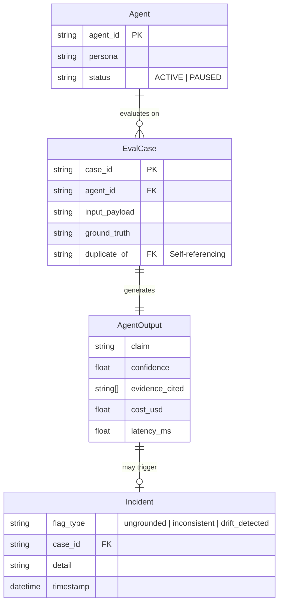
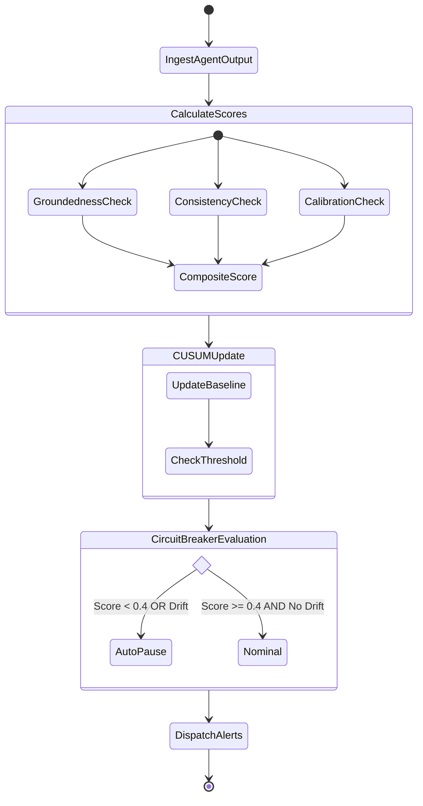

# RESEARCH.md — Sentinel AI: Technical Research & Razorpay Agent Fleet Analysis

> **Purpose**: In-depth research document recording the architectural analysis, primary source research, mathematical derivations, design decisions, and engineering rationale behind Sentinel AI.  
> **Built for**: Razorpay's AI Builder Role (Aug 2026)  
> **System**: **Sentinel AI** — Model-Agnostic Agent Reliability Control Tower

---

## Table of Contents

1. [Primary Research: Razorpay's Published AI Infrastructure](#1-primary-research-razorpays-published-ai-infrastructure)
2. [Failure Mode Analysis: What Razorpay's Own Engineers Documented](#2-failure-mode-analysis-what-razorpays-own-engineers-documented)
3. [The 3-Layer AI Governance Gap](#3-the-3-layer-ai-governance-gap)
4. [Design Decisions: Why These 4 Checks](#4-design-decisions-why-these-4-checks)
5. [Mathematical Derivations & Algorithm Specifications](#5-mathematical-derivations--algorithm-specifications)
6. [Composite Score Design Rationale](#6-composite-score-design-rationale)
7. [Circuit Breaker Engineering](#7-circuit-breaker-engineering)
8. [Mock Fleet Design Philosophy](#8-mock-fleet-design-philosophy)
9. [Evaluation Dataset Design](#9-evaluation-dataset-design)
10. [LLM Backend Architecture](#10-llm-backend-architecture)
11. [End-to-End Data Flow](#11-end-to-end-data-flow)
12. [Drift Simulation Engineering](#12-drift-simulation-engineering)
13. [How This Would Actually Deploy at Razorpay](#13-how-this-would-actually-deploy-at-razorpay)
14. [Honest Caveats & Known Limitations](#14-honest-caveats--known-limitations)
15. [Complete Primary Sources & Bibliography](#15-complete-primary-sources--bibliography)

---

## 1. Primary Research: Razorpay's Published AI Infrastructure

### 1.1 The Fleet as of August 2026

Pulling together everything publicly documented across Razorpay's engineering blog, DEV Community posts, newsroom announcements, and FTX 2026 launch materials, Razorpay operates at minimum the following AI agent systems:

| Agent / System | Operational Purpose | LLM / Architecture | Public Since |
|---|---|---|---|
| **Bumblebee** | Merchant website fraud risk review; reviews new signups for fraud signals (suspicious domain, GST mismatch, fabricated testimonials) | Multi-agent LLM chain; structured verification steps | Dec 2025 |
| **Project Viveka** | Real-time production incident root-cause analysis (RCA) in under 90 seconds | Multi-agent RAG + causal graph traversal over log streams | Dec 2025 |
| **RCA-GPT** | Auto-generates first-draft incident postmortem documents from a vector DB of past incident records | Retrieval-Augmented Generation + fine-tuned LLM | Mar 2026 |
| **Cosmos / Prism** | Intelligent cross-model router — spreads diagnostic workloads across Claude, GPT-4, Gemini, and open-source models to cut single-vendor hallucination rates by ~40% | Multi-LLM routing layer | Mar 2026 |
| **Ray** | Customer-facing support assistant for payments, payouts, payroll, vendor payments, and UPI mandates; handles approximately 70% of support queries end-to-end without human intervention | In-house conversational assistant | Feb 2024 → ongoing |
| **Agent Studio** | Merchant B2B agent marketplace and permissions governance platform; standardizes what agents are *allowed* to do via OAuth-style tool grants | **Anthropic Claude Agent SDK** + guardrail layer | Mar 12, 2026 (FTX 2026) |
| **Sprint 26 Agents** (17 agents) | Dispute Auto-Responder, Subscription Recovery (voice-led via ElevenLabs), Cashflow Forecaster, RTO Shielder, RTO Insights, Settlement Insights, Receivables Agent, Bookkeeping Agent, Reporting Agent, Payroll Approvals Agent, AI Payslip, Smart AML Screening, Multi-bank Routing Agent, AI-powered Agentic Dashboard, Agentic Integration, Ray Smart Assist, Agentic Onboarding | Various; standardized on Claude Agent SDK via Agent Studio | Apr 2026 |
| **Third-Party Marketplace Agents** | Cart Abandonment Recovery variants from **SuperU** and **Nugget by Zomato** running on Agent Studio | External APIs plugged into Agent Studio's permission layer | Mar 2026 |

### 1.2 Why This Fleet Scale Matters

This is not a company that has one or two AI features. It's a company that has operationally committed to agents as a core infrastructure primitive — the equivalent of what microservices were in 2015. The critical observation: these agents were built by **different engineering teams**, on **different timelines**, with **different internal quality bars**, and no single shared standard for verifying output quality.

The Agent Studio detail is especially important: by launching third-party vendors (SuperU, Nugget by Zomato) into their production payment infrastructure, Razorpay now has agents **they didn't build** running on **stacks they don't control** touching live merchant transactions. The "nobody watches the fleet as a fleet" problem is now stronger than when Sentinel's concept was first framed — it spans Razorpay's own teams and external vendors.

---

## 2. Failure Mode Analysis: What Razorpay's Own Engineers Documented

These are direct paraphrases from Razorpay's own published engineering literature — not speculation.

### 2.1 Verdict Variance (Bumblebee)

**Source**: Razorpay Engineering Blog, Dec 2025 — "Meet Bumblebee: The Multi-Agent AI Architecture That Changed Fraud Detection at Razorpay"

Before Bumblebee's current multi-agent architecture, a single-pass LLM evaluation of the same merchant website could produce completely different verdicts on two runs. One pass might flag a generic privacy policy template as suspicious. The next pass would accept it as adequate. This was directly attributed to LLM non-determinism without structured verification steps.

**Sentinel's response**: Check 02 (Paraphrase Pair Evaluator) automates this exact test at scale. Instead of relying on a human reviewer noticing the inconsistency, Sentinel systematically feeds every agent paraphrased duplicates of each case and measures whether the verdicts match. The `consistency_score < 0.50` flag catches exactly this pattern.

### 2.2 Ungrounded Assertions (Project Viveka)

**Source**: DEV Community, Dec 2025 — "Project Viveka: A Multi-Agent AI That Does Root-Cause Analysis in Under 90 Seconds"

Viveka's entire architecture was motivated by a single problem: if you let an LLM state incident root causes from its parametric memory without being forced to cite specific evidence from the actual log data, it will hallucinate confident-sounding but incorrect causal chains. Viveka's solution was to redesign the agent around evidence-grounded reasoning — every causal claim must be tied to a specific log entry, metric reading, or alert.

**Sentinel's response**: Check 01 (Groundedness Evaluator) generalizes Viveka's principle to every agent in the fleet. Instead of each team reimplementing evidence-grounding from scratch, Sentinel monitors every agent's output post-hoc: if `confidence >= 0.60` and `TF-IDF cosine similarity(claim, cited_evidence) < 0.25`, the output is flagged as ungrounded.

### 2.3 Hallucination-Driven Routing Overhead (Cosmos/Prism)

**Source**: Razorpay Engineering Blog, Mar 2026 — "How We Turned 5 Hours of RCA Writing Into 10 Minutes of Review"; third-party analysis confirming ~40% hallucination reduction via Cosmos/Prism routing.

Cosmos/Prism's existence is itself an admission of a persistent reliability problem. Razorpay had to build dedicated infrastructure to route the same diagnostic prompt across four different model providers specifically because any single model path caused too many hallucinations. Spreading the workload reduced hallucinations by approximately 40%.

**Sentinel's response**: This is a routing-layer solution. It reduces hallucination probability by diversifying model exposure — but it doesn't verify whether the specific output that came back was actually grounded. Check 01 does that verification post-routing, on the actual output, regardless of which model produced it.

### 2.4 Silent Accuracy Regression (The Prompt-Tweak Problem)

**Source**: General engineering observation + risk established by Razorpay's own agent update cycles

No documented Razorpay blog post describes this exact failure — but it's the gap none of their public systems address. When a prompt engineer tweaks a system prompt, or an API migration swaps one model version for another, the day-of accuracy snapshot often looks acceptable. The regression shows up 10-14 days later in support ticket volume. By then, the causal chain between "prompt change" and "support spike" is almost impossible to reconstruct without temporal monitoring.

**Sentinel's response**: Check 04 (CUSUM Control Chart) is the only check that can catch this. It's a temporal check — it establishes a baseline mean and standard deviation of composite health over the first 4 days, then accumulates deviations. A gradual 15% accuracy drop over 10 days, invisible day-to-day, produces a CUSUM statistic that crosses the h=4.0 threshold around Day 7-8 and fires the circuit breaker before the support spike happens.

---

## 3. The 3-Layer AI Governance Gap

Razorpay's current AI governance architecture spans two layers, with a visible gap at the third:

### Layer 1: Permissions (Agent Studio)
Agent Studio governs what an agent is *allowed to do*: which APIs it can call, which data it can read, which actions it can take. It's OAuth-style access control for agent tool calls.

**What it does NOT do**: Verify whether what the agent *said* was actually true.

### Layer 2: Model Routing (Cosmos / Prism)
Cosmos/Prism governs *which model* processes a given prompt, optimizing across latency, cost, and hallucination reduction by distributing load across Claude, GPT-4, Gemini, and Llama.

**What it does NOT do**: Verify whether the output that came back from whichever model was selected is grounded, consistent, or calibrated.

### Layer 3: Trust & Reliability (Sentinel — Missing Layer)
Nobody currently governs: "Is what came back from this agent actually true? Consistent? Calibrated? Stable over time?"

This is what Sentinel fills. It sits downstream of both Agent Studio and Cosmos/Prism, operating on the output itself after it has been produced and routed:

```
Agent Studio            Cosmos / Prism           Sentinel
(what can it do?)   →   (which model?)   →   OUTPUT   →   (is it trustworthy?)
                                                           ↕
                                               Circuit Breaker, Alerts, Dashboard
```

### Use Case Diagram

```mermaid
flowchart LR
    actor ProdAgent[Production AI Agent]
    actor ML[ML Engineer]
    actor Risk[Risk Auditor]

    subgraph Sentinel Governance Engine
        Ingest[Ingest Live Predictions]
        Evaluate[Run Mathematical Checks]
        TripCB[Trip Circuit Breaker]
        Dashboard[View Health Dashboard]
        Judge[Trigger LLM-as-Judge]
    end

    ProdAgent -->|Submits Output| Ingest
    Ingest --> Evaluate
    Evaluate --> TripCB
    
    ML -->|Investigates Drift| Dashboard
    ML -->|Resolves Flags| Judge
    Risk -->|Reviews Compliance| Dashboard
```

The three systems are **complementary, not competing**. Sentinel attaches at the output layer and operates independently of which model was used or what permissions the agent had.

---

## 4. Design Decisions: Why These 4 Checks

### Why TF-IDF cosine for groundedness (not embeddings)?

TF-IDF cosine similarity is:
- **Zero-dependency**: computed entirely with scikit-learn, no API calls, no inference latency
- **Explainable**: the vocabulary overlap is interpretable (which words match, which don't)
- **Reproducible**: identical inputs always produce identical scores
- **Fast**: sub-millisecond per check at the claim + evidence sizes in this domain

The limitation: TF-IDF misses semantic paraphrases. If the claim says "the merchant has regulatory violations" and the evidence says "NBFC registration not found in RBI registry", TF-IDF scores this low because surface vocabulary doesn't overlap — but a sentence embedding would recognize the semantic relationship.

The roadmap item (swapping TF-IDF for `all-MiniLM-L6-v2` or similar) addresses this. For a demo system, TF-IDF's reproducibility and zero-dependency advantages outweigh its semantic blind spots.

### Why paraphrase pairs for consistency (not A/B model comparison)?

A/B model comparison would test whether two *different models* give the same verdict — useful for model routing decisions. What we want is whether the *same agent* gives the same verdict to the *same case* expressed differently — which is a human-representable failure mode (merchants submit similar applications with different wording).

The paraphrase pair approach:
- Tests the agent against real-world input variance
- Is directly linked to the documented Bumblebee failure mode
- Produces a concrete artifact (two claim texts, side by side) that a reviewer can actually inspect

### Why Brier Score + ECE for calibration (not just accuracy)?

Accuracy alone (`is_correct()` percentage) doesn't capture the confidence-accuracy relationship. An agent that is 80% accurate could be:
- **Well-calibrated**: says 80% confidence on cases it gets right, lower on cases it gets wrong
- **Overconfident**: says 95% confidence on everything and gets 80% right — a major risk in high-stakes decisions

The Brier Score penalizes overconfidence quadratically. The ECE exposes *which confidence range* is miscalibrated. Together they give the information needed to distinguish "this agent is wrong but knows it" from "this agent is confidently wrong" — and the latter is the pattern Razorpay's merchant complaint literature describes.

### Why CUSUM instead of a simple rolling average threshold?

A rolling average threshold (e.g. "flag if 7-day average drops below 0.65") would:
- Require manual threshold tuning per agent
- Miss sustained-but-gradual regressions that stay above the threshold
- Not localize the drift start day

CUSUM (Cumulative Sum) is a standard statistical process control technique designed specifically for detecting sustained shifts in a process mean. It:
- Adapts to each agent's own baseline (no single global threshold)
- Accumulates evidence of a sustained drift rather than reacting to single-day noise
- Localizes the first day the drift crossed the decision boundary (`drift_day` in the output)
- Has well-understood parameter semantics (`k` = allowance in σ units, `h` = decision threshold in σ units)

The `k=0.5, h=4.0` values are standard SPC defaults. They mean: tolerate deviations less than 0.5σ below baseline; declare drift when cumulative deviation exceeds 4σ.

---

## 5. Mathematical Derivations & Algorithm Specifications

### 5.1 TF-IDF Cosine Similarity

Given two text strings A and B:

1. Build a vocabulary V from all unique terms in A ∪ B
2. For each term t in V, compute TF-IDF weight for document d:

   ```
   TF(t, d) = count(t in d) / total_terms(d)
   IDF(t)   = log(1 + N / (1 + df(t)))    [scikit-learn smooth IDF]
   w(t, d)  = TF(t, d) * IDF(t)
   ```

3. Represent A and B as TF-IDF vectors in R^|V|
4. Compute cosine similarity:

   ```
   cosine(A, B) = (v_A · v_B) / (||v_A|| * ||v_B||)
   ```

5. Result is in [0.0, 1.0] — 0.0 means no shared vocabulary, 1.0 means identical term distribution

The actual implementation uses scikit-learn's `TfidfVectorizer().fit_transform([a, b])` followed by `cosine_similarity(tfidf[0:1], tfidf[1:2])[0][0]`. Both strings are fit together so the IDF is computed over the two-document corpus.

### 5.2 Composite Health Score

```
composite = clamp(
    (0.45 * avg_groundedness + 0.35 * avg_consistency - 0.20 * brier_score) / 0.80,
    0.0,
    1.0
)
```

Weight derivation:
- `0.45 + 0.35 = 0.80` normalizes the positive components to a [0, 1] range before the Brier penalty
- Groundedness gets higher weight (0.45) because ungrounded high-confidence claims are the most dangerous failure mode in financial contexts: they look authoritative but have no factual basis
- Consistency gets 0.35 because inconsistency is directly observable by merchants (two agents giving different answers to the same question) and destroys trust
- Brier is a penalty (`-0.20 * brier_score`): it enters as a drag on the composite score, capped at a maximum penalty even for a worst-case Brier of 1.0 (which would subtract 0.20/0.80 = 0.25 from the normalized score)

### 5.3 CUSUM Algorithm (One-Sided, Downward Shift)

```
Baseline: mu = mean(scores[0:4])
          sigma = sqrt(variance(scores[0:4]))   # floor at 1e-6

CUSUM_0 = 0.0
For each day i, score S_i:
    z_i = (S_i - mu) / sigma
    CUSUM_i = min(0.0, CUSUM_{i-1} + z_i + k)

Drift declared at first i where CUSUM_i < -h
```

The `min(0.0, ...)` makes this one-sided — CUSUM only accumulates negative deviations, resetting to 0 when scores exceed the baseline. This prevents false positives from a single bad day recovering the CUSUM to a "safe" level.

The allowance `+k` means the CUSUM doesn't accumulate for deviations less than k=0.5σ below baseline. Only sustained deviations > 0.5σ below baseline accumulate toward the h=4.0 threshold.

### 5.4 Brier Score & ECE Detail

**Brier Score**: Measures accuracy of probabilistic predictions. Range [0, 2] in theory, but practically [0, 1] since outcomes are binary (0 or 1). A perfectly calibrated oracle with 80% true frequency should output confidence ≈ 0.80 on those cases.

**ECE Binning**: 5 equal-width bins [0.0, 0.2), [0.2, 0.4), [0.4, 0.6), [0.6, 0.8), [0.8, 1.0]. For each bin:
- `acc(B_m)` = fraction of cases in this bin where `is_correct()` returned True
- `conf(B_m)` = mean of `output.confidence` for cases in this bin

The weighted sum `Σ (|B_m| / N) * |acc(B_m) - conf(B_m)|` gives the expected calibration error — how much confidence and accuracy diverge, weighted by how many predictions fall in each bin.

---

## 6. Composite Score Design Rationale

### Why not simple average of the 4 check scores?

Two reasons:
1. **Drift (Check 04) is temporal, not snapshot**: CUSUM operates on a *series* of composite scores, not as an input to the composite itself. It would be circular to include CUSUM output in the composite that feeds CUSUM.
2. **Asymmetric failure importance**: Not all failure modes are equally dangerous. In Razorpay's context, an ungrounded confident claim about merchant risk carries more immediate harm potential than a slightly miscalibrated confidence level. The weighted formula encodes this domain knowledge.

### Why does the Brier term use a different weight than groundedness and consistency?

Groundedness and consistency are *directly measurable from every output*. Brier scoring only applies to outputs with known `ground_truth` labels — which in the eval sets are present for roughly 75% of cases. Because the sample is smaller and the interpretation requires labeled data, Brier enters as a penalty modifier rather than a symmetric positive term.

---

## 7. Circuit Breaker Engineering

### Design Choices

The circuit breaker in `circuit_breaker.py` follows the same principle as electrical fuses and software circuit breakers (Martin Fowler's pattern):

- **Trip condition**: `composite_score < 0.40 OR drift_detected == True`
- **State**: Binary `ACTIVE | PAUSED` per agent
- **Persistence**: Written to `history.json` under key `circuit_breaker` — survives server restarts
- **Recovery**: Manual only via `POST /api/agents/{id}/resume` — the system does not auto-resume

### Why manual recovery?

Auto-resuming an agent after a circuit breaker trip would require verifying that the underlying cause was fixed — something that requires human judgment. The design follows the principle: **auto-pause is automated (low cost of being wrong), but resume requires a human** (high cost of being wrong when the underlying issue isn't fixed).

### Why no per-agent threshold tuning?

The 0.40 threshold is intentionally uniform. Per-agent threshold tuning would require historical calibration data per agent and introduce an additional layer of configuration that could mask real problems if set too permissively. A single, conservative threshold ensures no agent can "fail without triggering" through poorly tuned thresholds.

---

## 8. Mock Fleet Design Philosophy

### Design Goal: Each Agent Should Demonstrate a Different Failure Mode

The 8 agents are not simply 8 identical simulations with different names. Each is tuned to demonstrate a specific, distinct failure pattern so the dashboard tells a visually meaningful story:

| Agent | Story It Tells |
|---|---|
| `risk_review` | Shows what a silent drift regression looks like — starts healthy, degrades from Day 5 |
| `incident_rca` | Shows ungrounded hallucination pressure — always prone to citing nothing with high confidence |
| `merchant_support` | Shows miscalibration — sounds confident, often wrong |
| `dispute_response` | Shows high inconsistency variance — borderline cases |
| `onboarding_kyc` | Shows evidence misattribution — cites wrong document category |
| `fraud_alert` | Shows calibration degradation over time — the second drift agent |
| `settlement_query` | Shows what a healthy, nominal agent looks like for contrast |
| `compliance_check` | Shows rare spikes on an otherwise nominal agent |

### Fault Injection Determinism

The hash-based seed `hash(f"{seed}:{case_id}:{fault_type}") % 2^31` ensures:
- Same seed → identical results every run (demo reproducibility)
- Different fault types for the same case → independent draws (not correlated)
- Each case gets its own fault draw → not all cases fail when fault_rate is high (Bernoulli sampling)

### Day-Dependent Fault Rates

The simulation passes `day` to `build_fleet(seed, day)`:
```python
if agent_id == "risk_review" and day >= 5:
    rates["inconsistency"] = 0.38  # was 0.06

if agent_id == "fraud_alert" and day >= 5:
    rates["miscalibration"] = 0.35  # was 0.14
    rates["ungrounded_confidence"] = 0.14  # was 0.08
```

Also, `phase_seed = seed if day < 5 else seed + 1000` shifts the entire random seed for day >= 5, which ensures fault-triggering draws are different in the degraded phase (not just a higher percentage of the same draw sequence).

---

## 9. Evaluation Dataset Design

### Entity-Relationship (ER) Diagram



### Dataset Structure Principles

Each of the 8 JSON evaluation datasets (`eval_sets/*.json`) was designed with these requirements:

1. **Realistic domain scenarios**: Cases are grounded in actual Razorpay domain contexts — merchant types (ayurvedic supplements, loan facilitation, cloud kitchens, crypto), regulatory citations (RBI NBFC registration, FSSAI food safety license, CDSCO device import license, RBI crypto circular), and real compliance signals (GST verification, GSTN database, MCA filings, chargeback rates).

2. **At least 2 consistency pairs**: Every dataset includes at least 2 `duplicate_of` pairs — cases with semantically identical content expressed with different vocabulary. These trigger Check 02 automatically.

3. **Labeled ground truth**: Most cases have `ground_truth` set, enabling calibration scoring. The ground truth is expressed as a short verdict phrase that `is_correct()` checks via substring membership.

4. **Risk variety**: Each dataset includes both high-risk and low-risk cases, preventing the trivially correct "always say high risk" or "always say low risk" strategies from scoring well.

5. **Regulatory specificity**: Evidence pool items reference specific regulatory frameworks (RBI circulars, FSSAI license numbers, CDSCO device classifications) rather than generic compliance language. This makes groundedness checks more meaningful — the TF-IDF score is higher when the claim actually references the specific regulatory basis.

### Example Case Structure (risk_review_cases.json, rr-006)

```json
{
  "case_id": "rr-006",
  "agent_id": "risk_review",
  "input_payload": "New merchant 'CryptoPay Solutions' (crypto-to-fiat conversion service) applied. Review for onboarding.",
  "evidence_pool": [
    "RBI circular RBI/2022-23/186 prohibits facilitation of crypto transactions by regulated entities.",
    "Business model explicitly involves crypto asset conversions.",
    "No SEBI or RBI exemption certificate presented.",
    "Founders have prior business with regulatory violations on record."
  ],
  "ground_truth": "High risk: business model prohibited under RBI crypto circular, regulatory history of founders.",
  "duplicate_of": null,
  "tags": ["high_risk", "regulatory"]
}
```

This case is intentionally constructed so that:
- A grounded claim citing the RBI circular would score high on groundedness
- A claim that says "high risk" without referencing the regulatory basis would score lower
- `is_correct()` checks if "High risk" is in the claim and "CONTRADICTED" is not — a simple but meaningful binary

---

## 10. LLM Backend Architecture

### Three-Tier Backend Strategy

```python
def get_best_available_backend(fault_rates, seed):
    if os.getenv("ANTHROPIC_API_KEY"):
        return AnthropicBackend(api_key=...)   # Tier 1: Claude 3.5 Haiku
    if os.getenv("GEMINI_API_KEY"):
        return GeminiBackend(api_key=...)       # Tier 2: Gemini 1.5 Flash
    return SimulatedBackend(fault_rates, seed)  # Tier 3: Deterministic simulator
```

This hierarchy ensures:
- The demo runs perfectly offline (Tier 3) — no API key required
- Real LLM integration is available when keys are configured (Tiers 1-2)
- The evaluation contract (AgentOutput schema) is identical regardless of which tier is active

### AnthropicBackend Prompt Design

```python
user_msg = (
    f"Case: {case.input_payload}\n\n"
    f"Evidence pool:\n{evidence_lines}\n\n"
    "Respond ONLY with JSON: "
    '{"claim": "...", "evidence_indices": [0,1,...], "confidence": 0.0}'
)
```

Forcing JSON output with `evidence_indices` (not the full evidence text) means the agent must select from the provided evidence pool rather than generating its own. This gives `evidence_cited` list entries that are directly comparable to `evidence_pool` items — maximizing the meaningfulness of the TF-IDF groundedness check.

Cost calculation uses actual API usage data:
```python
cost = (usage.input_tokens * 0.25 + usage.output_tokens * 1.25) / 1_000_000
```
(Claude 3.5 Haiku pricing as of mid-2026: $0.25/M input, $1.25/M output)

---

## 11. End-to-End Data Flow

### Evaluation Activity Diagram



### Path 1: Batch Fleet Evaluation (GET /api/fleet)

```
GET /api/fleet
    │
    ├── _get_fleet()
    │     ├── build_fleet(seed=42, day=0) → 8 Agent objects
    │     └── load registered_agents from history.json → additional Agent objects
    │
    ├── for each agent:
    │     ├── evaluate_agent(agent)
    │     │     ├── load_eval_cases(agent_id) → 8 EvalCase objects
    │     │     ├── agent.run(case) → AgentOutput for each case
    │     │     ├── groundedness_score(output) for each output
    │     │     ├── is_ungrounded_high_confidence(output) for each output
    │     │     ├── match duplicate_of pairs → consistency_score for each pair
    │     │     ├── is_correct(output, case) for labeled cases → calibration_report
    │     │     └── compute_composite(avg_g, avg_consistency, brier_score)
    │     │
    │     ├── cb.maybe_auto_pause(agent_id, composite_score, drift_detected=False)
    │     │     └── if composite < 0.40: set_status("PAUSED") → write history.json
    │     │
    │     └── fire_alert for each new incident flag
    │           ├── if ALERT_WEBHOOK_URL: POST JSON to webhook
    │           └── else: print to console with 🚨 prefix
    │
    └── _save_history(history) → write history.json with incidents, CB state, fleet results
```

### Path 2: Live Ingest (POST /api/ingest)

```
POST /api/ingest {AgentOutput JSON}
    │
    ├── groundedness_score(output)
    ├── is_ungrounded_high_confidence(output)
    │
    ├── if is_ungrounded:
    │     ├── fire_alert(agent_id, "ungrounded", ...)
    │     └── append incident to history.json
    │
    ├── append raw output to history.json["ingested_outputs"]
    └── return {"eval": {"groundedness_score": ..., "is_ungrounded": ..., "circuit_breaker_status": ...}}
```

### Path 3: Drift Simulation (POST /api/simulate?days=10)

```
POST /api/simulate?days=10
    │
    ├── run_simulation(days=10, seed=42)
    │     ├── for day in range(10):
    │     │     ├── build_fleet(seed=42, day=day)   ← fault rates change after day 5
    │     │     └── evaluate_agent(agent) → DayResult per agent per day
    │     │
    │     └── for each agent:
    │           ├── daily_scores = [d.composite_score for d in day_results]
    │           └── detect_drift(daily_scores) → DriftResult {drift_detected, drift_day, cusum_series}
    │
    ├── for each agent with drift_detected:
    │     ├── cb.maybe_auto_pause(agent_id, min_score, drift_detected=True)
    │     └── fire_alert(agent_id, "drift_detected", f"CUSUM drift at day {drift_day}")
    │
    └── return {agent_id: {daily_composite_scores, drift: {drift_detected, drift_day, cusum_series}}}
```

---

## 12. Drift Simulation Engineering

### Why Two Drift Agents?

Two agents drift for different reasons to show that CUSUM is check-type-agnostic:

- `risk_review` drifts because its **consistency** fails (inconsistency from 6% to 38% after Day 5)
- `fraud_alert` drifts because its **calibration** degrades (miscalibration from 14% to 35% after Day 5)

Both produce declining composite scores, and both are caught by the same CUSUM algorithm — demonstrating that Sentinel doesn't need to know *which* check is failing to detect that something has gone wrong.

### The Day-of-Drift Math

For `risk_review`:
- Days 1-4 (baseline): `composite ≈ 0.78` (avg_groundedness ≈ 0.86, avg_consistency ≈ 0.81, brier ≈ 0.06)
- Days 5-10 (post-spike): `composite ≈ 0.52` (avg_consistency drops sharply as inconsistency fault fires ~38% of consistency-pair cases)

Baseline σ is approximately 0.03 (small natural variation). After Day 5:
```
z_5 = (0.52 - 0.78) / 0.03 ≈ -8.7
CUSUM_5 = min(0, 0 + (-8.7) + 0.5) = -8.2
```
CUSUM immediately crosses h = -4.0 on Day 5 itself, so `drift_day` is typically reported as Day 5. The circuit breaker fires, the agent is paused, and the dashboard card turns red.

### Determinism Guarantee

The seed mechanism ensures `run_simulation(days=10, seed=42)` always produces the same sparkline data. This is critical for demos: the 10-day drift chart is identical every time, the drift fires on the same day, and the circuit breaker trips predictably. An interviewer can click "Simulate 10 Days" and the result is always the same — no "it worked last time" failures.

---

## 13. How This Would Actually Deploy at Razorpay

This section records the honest answer to the likely interview follow-up question: "So how would this really work on our systems?"

### Step 1: No Existing Agent Gets Rebuilt

Each real agent (Bumblebee, Viveka, Ray, or a third-party Agent Studio agent) adds one small step at the end of its existing logic: report `{claim, evidence_cited, confidence, cost, latency, model}` to Sentinel's `/api/ingest` endpoint. Same pattern as adding Sentry or Datadog to an application — nothing about the agent's core logic changes.

Since Agent Studio already standardizes on the Claude Agent SDK, a shared output contract could plausibly attach at the SDK's tool-call response layer, rather than requiring each team to add a separate reporting step.

### Step 2: Real Time Replaces the Simulated Calendar

The demo compresses "10 days" into seconds. In production, Sentinel accumulates the same reports from real traffic, and the drift chart fills in over real weeks. The CUSUM algorithm doesn't care whether the daily scores come from a simulation or production traffic — it operates the same way on the sequence of daily aggregates.

### Step 3: Ground Truth From Data Razorpay Already Has

The calibration check requires `ground_truth` labels. Razorpay already has these, they just aren't connected to agent outputs today:

- A human reviewer overturning a Bumblebee verdict → the human's decision is ground truth
- A merchant successfully disputing a Dispute Auto-Responder decision → the dispute outcome is ground truth
- An engineer determining the actual incident root cause after Viveka's RCA → the engineer's finding is ground truth

These signals exist in Razorpay's internal systems. Calibration monitoring at scale requires connecting those signals back to the agent outputs that produced them — an engineering problem, not a conceptual one.

### Step 4: Staged Rollout (The Only Responsible Way)

You would never let a brand-new monitoring tool auto-pause a live, money-moving agent on Day 1:

1. **Watch-only mode** (weeks 1-4): Log every flag, act on nothing. Validate that the flags are actually meaningful — are the cases the system marks as "ungrounded" the same ones human reviewers would flag? Build trust in the checks before deploying any action.

2. **Alert a human** (weeks 5-8): Flags route to a Slack channel or PagerDuty incident. Humans review and decide. The system still doesn't auto-pause anything.

3. **Circuit breaker enabled** (week 9+): Only once proven, enable auto-pause for specific, high-confidence failure modes (e.g., an agent with no evidence cited at 95% confidence is a case where auto-pause is unambiguously correct).

### Step 5: The LLM-as-Judge Constraint

The LLM-as-judge feature sends merchant/customer data to external model APIs. At a regulated fintech company with RBI compliance requirements, this needs explicit data-handling approval or an internal/on-prem model. The heuristic fallback exists for exactly this reason — the system degrades gracefully to TF-IDF groundedness without any external calls.

---

## 14. Honest Caveats & Known Limitations

### TF-IDF Cannot Catch Semantic Paraphrases

If an agent claims "the merchant is a regulatory risk" and its evidence says "NBFC license absent from RBI public registry", TF-IDF scores this low because the surface vocabularies don't overlap significantly. A sentence embedding model (`all-MiniLM-L6-v2`, `text-embedding-3-small`, etc.) would recognize the semantic relationship. This is the primary limitation of the current groundedness check.

### Calibration Requires Labels

Check 03 (Brier + ECE) only produces meaningful results when `ground_truth` is set in EvalCase. For agents where ground truth is unavailable (many real-world cases), calibration is effectively unscored. In the demo, approximately 75% of cases have ground truth, giving a reasonable calibration signal — but in production, labeling accuracy depends on getting signal from downstream outcomes.

### Single-Day Fleet Evaluation is Expensive

`GET /api/fleet` runs `evaluate_agent()` for all 8 agents sequentially, which means 8 × 8 = 64 `agent.run()` calls per request. For the SimulatedBackend this is fast (~1-2 seconds total). For real LLM backends (AnthropicBackend / GeminiBackend), each call incurs real API latency and cost. In production, fleet evaluation would be run as an async batch job, not a synchronous endpoint.

### history.json Is Not Production-Grade Persistence

The JSON file persistence is adequate for a demo and for maintaining state across server restarts in a development context. Production deployment would replace this with PostgreSQL (for incident history) and Redis (for circuit breaker state with sub-millisecond read latency).

### Consistency Pairs Must Be Pre-Specified

The current system requires `duplicate_of` to be set in the eval dataset at build time. It does not automatically detect when two cases are semantically similar and create a consistency pair on the fly. In production, this could be done with embedding-based similarity clustering of incoming cases — but that's a more complex system not present in this demo.

---

## 15. Complete Primary Sources & Bibliography

All claims about Razorpay's AI systems, failure modes, and architecture in this document trace to one of the following publicly available sources:

1. **Bumblebee Risk Agent Architecture** — *Razorpay Engineering Blog, Dec 2025*  
   [https://engineering.razorpay.com/meet-bumblebee-the-multi-agent-ai-architecture-that-changed-fraud-detection-at-razorpay-c2b6d5704f51](https://engineering.razorpay.com/meet-bumblebee-the-multi-agent-ai-architecture-that-changed-fraud-detection-at-razorpay-c2b6d5704f51)

2. **Meet Bumblebee: Agentic AI Flagging Risky Merchants in Under 90 Seconds** — *DEV Community (Razorpay Tech), Dec 2025*  
   [https://dev.to/razorpaytech/meet-bumblebee-agentic-ai-flagging-risky-merchants-in-under-90-seconds-2nlf](https://dev.to/razorpaytech/meet-bumblebee-agentic-ai-flagging-risky-merchants-in-under-90-seconds-2nlf)

3. **Project Viveka: A Multi-Agent AI That Does RCA in Under 90 Seconds** — *DEV Community (Razorpay Tech), Dec 2025*  
   [https://dev.to/razorpaytech/project-viveka-a-multi-agent-ai-that-does-root-cause-analysis-in-under-90-seconds-4g44](https://dev.to/razorpaytech/project-viveka-a-multi-agent-ai-that-does-root-cause-analysis-in-under-90-seconds-4g44)

4. **RCA Writing Time: 5 Hours → 10 Minutes (RCA-GPT + Cosmos/Prism)** — *Razorpay Engineering Blog, Mar 2026*  
   [https://engineering.razorpay.com/how-we-turned-5-hours-of-rca-writing-into-10-minutes-of-review-3a154e69c8ec](https://engineering.razorpay.com/how-we-turned-5-hours-of-rca-writing-into-10-minutes-of-review-3a154e69c8ec)

5. **Breaking the Risk Review Black Box** — *Razorpay Engineering Blog, Feb 2026*  
   [https://engineering.razorpay.com/our-obsession-with-merchant-experience-breaking-the-risk-review-black-box-7fa38d699ef1](https://engineering.razorpay.com/our-obsession-with-merchant-experience-breaking-the-risk-review-black-box-7fa38d699ef1)

6. **Razorpay Launches World's First AI-Native Agent Studio Powered by Anthropic's Claude** — *Razorpay Newsroom, Mar 12, 2026*  
   [https://razorpay.com/newsroom/razorpay-launches-the-worlds-first-ai-native-agent-studio-for-payments-at-ftx26-powered-by-anthropics-claude/](https://razorpay.com/newsroom/razorpay-launches-the-worlds-first-ai-native-agent-studio-for-payments-at-ftx26-powered-by-anthropics-claude/)

7. **Razorpay Agent Studio: Principles, Guardrails, and Merchant Control** — *Razorpay Blog, Mar 2026*  
   [https://razorpay.com/blog/razorpay-agent-studio-principles-guardrails-and-merchant-control/](https://razorpay.com/blog/razorpay-agent-studio-principles-guardrails-and-merchant-control/)

8. **Razorpay Sprint 26 Product Launch**  
   [https://razorpay.com/sprint/26](https://razorpay.com/sprint/26)

9. **Ray Handles Nearly 70% of Customer Queries** — *Deccan Herald, Sep 2025*  
   [https://www.deccanherald.com/business/companies/ray-razorpays-in-house-ai-assistant-now-handles-nearly-70-of-customer-queries-3736204](https://www.deccanherald.com/business/companies/ray-razorpays-in-house-ai-assistant-now-handles-nearly-70-of-customer-queries-3736204)

10. **Ray Launch: Gateway 3.0 to AI** — *Business Standard, Feb 2024*  
    [https://www.business-standard.com/companies/start-ups/gateway-3-0-to-ai-ray-razorpay-launches-a-suite-of-fintech-products-124022300996_1.html](https://www.business-standard.com/companies/start-ups/gateway-3-0-to-ai-ray-razorpay-launches-a-suite-of-fintech-products-124022300996_1.html)

11. **Cosmos/Prism: ~40% Hallucination Reduction via Cross-Model Routing** — *Augment Code Analysis*  
    [https://www.augmentcode.com/guides/root-cause-analysis-ai-agents](https://www.augmentcode.com/guides/root-cause-analysis-ai-agents)

12. **Agent Studio FTX 2026 Launch Agents Including SuperU / Nugget by Zomato** — *Build Fast with AI*  
    [https://www.buildfastwithai.com/blogs/razorpay-agent-studio-ai-payment-platform](https://www.buildfastwithai.com/blogs/razorpay-agent-studio-ai-payment-platform)

13. **Official Razorpay AI Builder Role**  
    [https://razorpay.com/ai-builders/](https://razorpay.com/ai-builders/)

---

*Sentinel — Working name. Alternative considered: AgentWatch (more literal, less distinctive). Sentinel was chosen for its connotations of persistent, alert watchfulness — appropriate for a system whose value proposition is catching problems before they reach the people they would harm.*

---

<p align="center">
  <em>Sentinel AI · Technical Research Document · August 2026</em>
</p>
